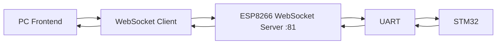
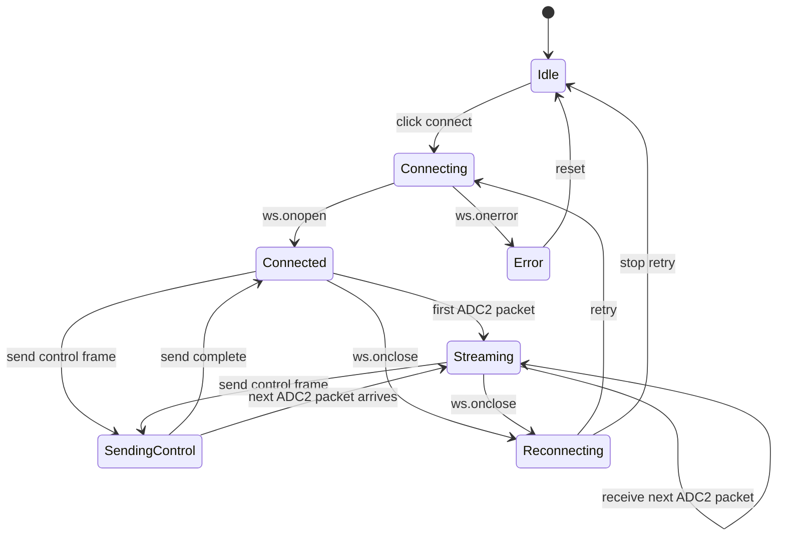
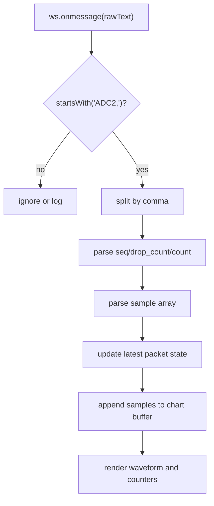

# PC-ESP8266-STM32 WebSocket 通信与接口文档

## 1. 目标

本文档只描述一条链路：

- PC 通过 WebSocket 连接 ESP8266
- ESP8266 与 STM32 串口通信
- PC 向 STM32 下发控制指令
- STM32 将 ADC2 数值以流式文本包发送到 PC 前端显示

本文档不覆盖 RAG、数据库、配置管理或其他页面接口。

## 2. 链路总览



当前建议按新固件 worktree 作为基线：

- `D:\AntigravityProject\.worktrees\adc2-streaming\firmware\etching_controller\`

ESP8266 桥接参考：

- `D:\AntigravityProject\firmware\esp8266_websocket_bridge\README.md`
- `D:\AntigravityProject\firmware\esp8266_websocket_bridge\esp8266_websocket_bridge.ino`

## 3. 连接与参数

### 3.1 网络参数

- WebSocket 地址：`ws://<ESP8266_IP>:81/`
- WebSocket 端口：`81`

### 3.2 ESP8266 参数

- Wi-Fi SSID：`XuHou_Group_2.4G`
- Wi-Fi Password：`XH123456`
- 串口侧按“整行文本”转发

### 3.3 STM32 串口角色

根据新固件：


- `USART3 @ 115200`
  - 用于向 ESP8266 发送 ADC2 流式数据 与接受控制帧

来源：

- [main.c](D:\AntigravityProject\.worktrees\adc2-streaming\firmware\etching_controller\Core\Src\main.c)
- [usart.c](D:\AntigravityProject\.worktrees\adc2-streaming\firmware\etching_controller\Core\Src\usart.c)

## 4. 双向通信定义

### 4.1 上行：STM32 -> ESP8266 -> PC

这是当前已经明确实现的链路。

流程：

1. STM32 采集 ADC2
2. 每 20 个采样点组成一包
3. STM32 通过 `USART3` 输出文本包
4. ESP8266 按行读取串口
5. ESP8266 将整行通过 WebSocket 广播到 PC

### 4.2 下行：PC -> ESP8266 -> STM32

这是当前桥接层已预留、但还需要协议收口的链路。

流程：

1. PC 通过 WebSocket 发文本
2. ESP8266 将文本原样写入串口
3. ESP8266 末尾补一个换行 `\n`
4. STM32 负责解析收到的数据

关键现状：

- ESP8266 下行是“文本透传”
- STM32 控制输入是“8 字节帧”
- 所以下行控制真正闭环还需要一层协议适配

## 5. ADC2 流式数据接口

### 5.1 STM32 发送逻辑

在新固件中已确认：

- `ADC2_STREAM_SAMPLE_COUNT = 20`
- 使用双缓冲保存 ADC2 数据
- `SendAdc2Chunk()` 负责组包
- 最终通过 `HAL_UART_Transmit(&huart3, ...)` 发出

来源：

- [main.c](D:\AntigravityProject\.worktrees\adc2-streaming\firmware\etching_controller\Core\Src\main.c)

### 5.2 文本包格式

当前已确认格式：

```text
ADC2,<seq>,<drop_count>,20,<v1>,<v2>,...,<v20>\r\n
```

字段说明：

| 字段 | 含义 |
| --- | --- |
| `ADC2` | 固定包类型 |
| `seq` | 包序号 |
| `drop_count` | 丢包计数 |
| `20` | 当前包内采样点数 |
| `v1...v20` | 20 个 ADC2 原始采样值 |

示例：

```text
ADC2,128,0,20,4012,4010,4007,4004,4001,3998,3995,3991,3988,3985,3981,3978,3975,3971,3968,3965,3962,3959,3955,3952
```

### 5.3 ESP8266 转发规则

ESP8266 当前规则：

- 忽略 `\r`
- 收到 `\n` 才广播
- 单行缓冲区大小 `256` 字节

因此 STM32 发送端必须满足：

- 每个包都以 `\r\n` 结束
- 单行长度不能过长

### 5.4 PC 前端接收规范

PC 应连接：

```text
ws://<ESP8266_IP>:81/
```

前端收到消息后的建议解析流程：

1. 判断是否以 `ADC2,` 开头
2. 按逗号拆分
3. 读取 `seq`、`drop_count`、`count`
4. 把后续 20 个值转为整数数组
5. 更新图表

建议前端内部对象：

```json
{
  "type": "ADC2",
  "seq": 128,
  "drop_count": 0,
  "count": 20,
  "samples": [4012, 4010, 4007, 4004, 4001, 3998, 3995, 3991, 3988, 3985, 3981, 3978, 3975, 3971, 3968, 3965, 3962, 3959, 3955, 3952]
}
```

## 6. PC 控制 STM32 接口

### 6.1 STM32 当前控制输入协议

控制接收逻辑位于：

- [usartCallback.c](D:\AntigravityProject\.worktrees\adc2-streaming\firmware\etching_controller\MDK-ARM\usartCallback.c)

已确认：

- 使用 `USART3`
- DMA 接收固定 8 字节
- `RxBuf[0] == 0xFF`
- `RxBuf[7] == 0xFF`

### 6.2 8 字节控制帧格式

当前源码能确认的结构：

| 字节位 | 含义 |
| --- | --- |
| `RxBuf[0]` | 帧头 `0xFF` |
| `RxBuf[1]` | 参数 1 |
| `RxBuf[2]` | 参数 2 |
| `RxBuf[3]` | 参数 3 |
| `RxBuf[4]` | 模式位 |
| `RxBuf[5]` | 参数 5 |
| `RxBuf[6]` | 指令码 |
| `RxBuf[7]` | 帧尾 `0xFF` |

### 6.3 自动刻蚀参数帧

当 `RxBuf[4] == 0x00` 时：

- `echinglength = (RxBuf[2] << 8) | RxBuf[1]`
- `echingtime = RxBuf[3]`
- `echingcounts = RxBuf[5]`
- `Flags = 16`

可表示为：

```text
[0xFF, length_low, length_high, time_s, 0x00, counts, cmd, 0xFF]
```

### 6.4 已确认控制码

| 指令码 | 含义 | STM32 动作 |
| --- | --- | --- |
| `0x01` | 旋转轴正向 | `Flags = 1` |
| `0x02` | 旋转轴反向 | `Flags = 2` |
| `0x03` | 旋转轴停止 | `Flags = 3` |
| `0x04` | 模式切换 | `AC_DC = 0` |
| `0x05` | Z 轴上升 | `Flags = 5` |
| `0x06` | Z 轴下降 | `Flags = 6` |
| `0x07` | Z 轴停止 | `Flags = 7` |
| `0x08` | 模式切换 | `AC_DC = 1` |
| `0x09` | 增亮 | `Flags = 9` |
| `0x0A` | 降亮 | `Flags = 10` |
| `0x0B` | 中断状态 1 | `State = 1` |
| `0x0C` | 中断状态 2 | `State = 2` |
| `0x0D` | 关闭 Twins | `Twins = 0` |
| `0x0E` | 开启 Twins | `Twins = 1` |

## 7. 推荐的 PC WebSocket 控制格式

因为 ESP8266 当前只能透传文本，推荐 PC 先发“hex 文本帧”。

### 7.1 推荐发送格式

```text
FF 58 02 1E 00 01 10 FF
```

或：

```text
FF,58,02,1E,00,01,10,FF
```

### 7.2 为什么推荐这样做

- 浏览器里容易发
- 调试方便
- 比 JSON 更接近 STM32 当前控制帧

### 7.3 需要补的适配层

这一步当前仓库里还没有实现：

- ESP8266 把 hex 文本转成字节流，再写给 STM32

或者：

- STM32 额外增加一套文本控制协议解析

如果目标是尽快打通，优先建议在 ESP8266 做 hex 文本转字节帧。

## 8. 前端显示接口建议

PC 前端建议至少提供：

- WebSocket 连接/断开
- 控制帧输入与发送
- ADC2 实时波形区
- 最近包序号
- 丢包计数

建议前端状态结构：

```json
{
  "connected": true,
  "url": "ws://192.168.1.23:81/",
  "last_seq": 128,
  "drop_count": 0,
  "samples_window": [],
  "last_control_frame": "FF 58 02 1E 00 01 10 FF"
}
```

### 8.1 前端 WebSocket 消息示例

#### 建立连接

前端连接示例：

```js
const ws = new WebSocket("ws://192.168.1.23:81/");
```

建议事件处理：

```js
ws.onopen = () => {
  console.log("ws connected");
};

ws.onmessage = (event) => {
  const text = String(event.data || "");
  if (!text.startsWith("ADC2,")) return;

  const parts = text.split(",");
  const seq = Number(parts[1] || 0);
  const dropCount = Number(parts[2] || 0);
  const count = Number(parts[3] || 0);
  const samples = parts.slice(4, 4 + count).map((value) => Number(value));

  console.log({ seq, dropCount, count, samples });
};

ws.onclose = () => {
  console.log("ws disconnected");
};

ws.onerror = (error) => {
  console.error("ws error", error);
};
```

#### 接收 ADC2 流

ESP8266 转发到前端的原始文本示例：

```text
ADC2,128,0,20,4012,4010,4007,4004,4001,3998,3995,3991,3988,3985,3981,3978,3975,3971,3968,3965,3962,3959,3955,3952
```

前端解析后的对象示例：

```json
{
  "type": "ADC2",
  "seq": 128,
  "drop_count": 0,
  "count": 20,
  "samples": [4012, 4010, 4007, 4004, 4001, 3998, 3995, 3991, 3988, 3985, 3981, 3978, 3975, 3971, 3968, 3965, 3962, 3959, 3955, 3952]
}
```

#### 发送控制帧

前端发送示例：

```js
ws.send("FF 58 02 1E 00 01 10 FF");
```

或：

```js
ws.send("FF,58,02,1E,00,01,10,FF");
```

建议前端发送前做两步校验：

1. 校验是否正好 8 个字节
2. 校验首尾是否为 `FF`

示例校验逻辑：

```js
function normalizeFrame(input) {
  const parts = input
    .trim()
    .replaceAll(",", " ")
    .split(/\s+/)
    .filter(Boolean)
    .map((item) => item.toUpperCase());

  if (parts.length !== 8) {
    throw new Error("control frame must contain 8 bytes");
  }

  if (parts[0] !== "FF" || parts[7] !== "FF") {
    throw new Error("control frame must start and end with FF");
  }

  return parts.join(" ");
}
```

### 8.2 前端页面交互建议

建议把页面交互拆成 3 个区域：

- 连接区
  - 输入 ESP8266 WebSocket 地址
  - 连接/断开按钮
- 控制区
  - 快捷控制按钮
  - 原始控制帧输入框
  - 最近一次发送帧显示
- 遥测区
  - 实时波形
  - 当前包序号
  - 丢包计数
  - 最近一包 20 点数值表

推荐快捷按钮和控制码映射：

| 前端动作 | 推荐发送帧示例 | 含义 |
| --- | --- | --- |
| Z 轴上升 | `FF 00 00 00 01 00 05 FF` | `Flags = 5` |
| Z 轴下降 | `FF 00 00 00 01 00 06 FF` | `Flags = 6` |
| Z 轴停止 | `FF 00 00 00 01 00 07 FF` | `Flags = 7` |
| 旋转正向 | `FF 00 00 00 01 00 01 FF` | `Flags = 1` |
| 旋转反向 | `FF 00 00 00 01 00 02 FF` | `Flags = 2` |
| 旋转停止 | `FF 00 00 00 01 00 03 FF` | `Flags = 3` |

说明：

- 上表是为了前端联调给出的推荐示例帧
- 当前源码只明确了 `RxBuf[6]` 的指令位语义
- `RxBuf[1..5]` 在非自动刻蚀命令中的最终规范，仍建议在你们联调时固定下来

### 8.3 前端状态机图



### 8.4 前端数据流图



## 9. 当前已实现与待补齐

### 已实现

- STM32 新固件经 `USART3 @ 115200` 输出 ADC2 文本流
- ESP8266 按行读取串口并通过 WebSocket 广播
- ESP8266 支持 WebSocket 文本写回串口 

### 待补齐

- PC 控制文本到 STM32 8 字节帧的适配
- PC 前端正式的 WebSocket 控制页面
- 控制指令发送后的回执协议

## 10. 联调顺序

建议按下面顺序推进：

1. 烧录 `.worktrees/adc2-streaming` 的 STM32 新固件
2. 先打通 ADC2 流式显示
3. 再实现 PC 控制帧发送
4. 最后补下行控制适配

## 11. 权威源码

- [STM32 main.c](D:\AntigravityProject\.worktrees\adc2-streaming\firmware\etching_controller\Core\Src\main.c)
- [STM32 usart.c](D:\AntigravityProject\.worktrees\adc2-streaming\firmware\etching_controller\Core\Src\usart.c)
- [STM32 usartCallback.c](D:\AntigravityProject\.worktrees\adc2-streaming\firmware\etching_controller\MDK-ARM\usartCallback.c)
- [ESP8266 bridge sketch](D:\AntigravityProject\firmware\esp8266_websocket_bridge\esp8266_websocket_bridge.ino)
- [ESP8266 bridge README](D:\AntigravityProject\firmware\esp8266_websocket_bridge\README.md)

## 12. 结论

这条链路目前已经具备“STM32 ADC2 流式数据 -> ESP8266 -> PC 前端显示”的核心能力。

还差的关键点只有一个：

- 把 PC 发下来的 WebSocket 控制文本，稳定映射成 STM32 当前识别的 8 字节控制帧

这一步补上后，`PC -> ESP8266 -> STM32` 的双向链路就完整了。
